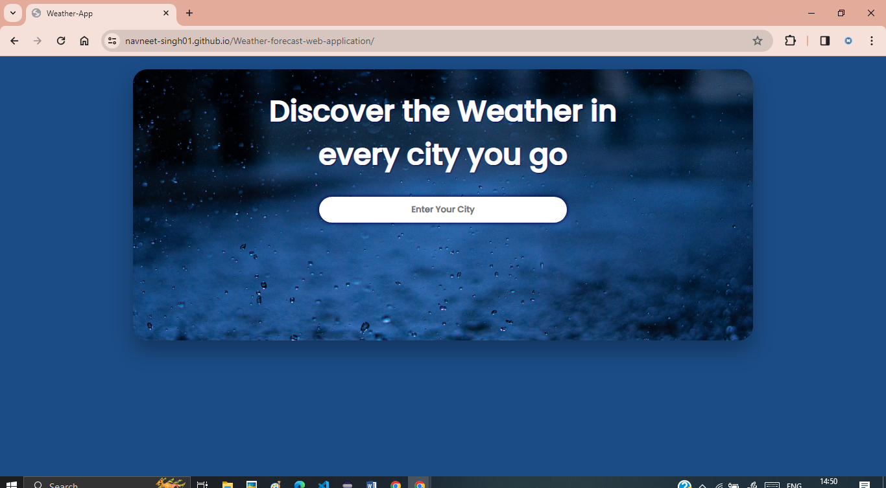
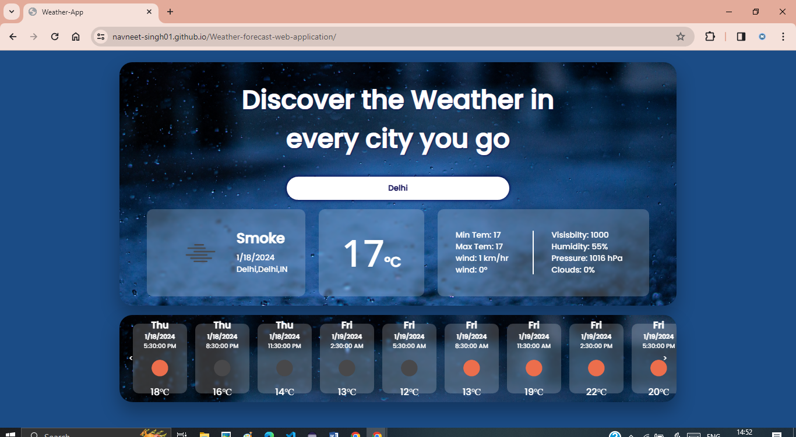
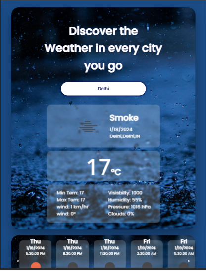

# Weather-forecast-web-application

This Weather App uses weather APIs, allows users to get real-time weather information and a 5-day/3-hours forecast for any city. The app displays the current temperature, weather description, date, and additional details such as wind speed, visibility, humidity, and pressure.

## Features

- Real-time weather information
- 5-day weather forecast
- Every 3-hours weather forecast
- Responsive design for various screen sizes

## website link

[Link to live demo](https://navneet-singh01.github.io/Weather-forecast-web-application/)

## Technologies Used

- HTML
- CSS
- JavaScript

## APIs Used

- https://api.openweathermap.org

## Screenshots

### 1. Screenshot 1

### 2. Screenshot 2

### 3. Screenshot 3

## Usage

- Enter the name of the city in the input field.
- Press "Enter" to fetch weather information.
- Explore the current weather and forecast details.

## Author

Navneet Singh (https://github.com/Navneet-Singh01)